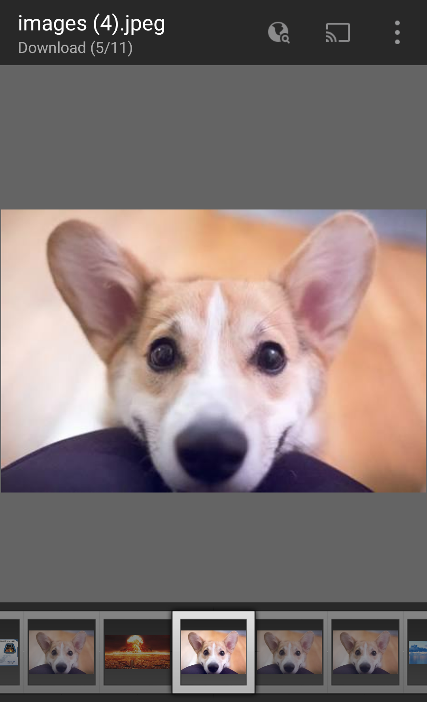

#         Duplicate Image Finder

**1.Tools and Technology used**

*         Android Studio
*         Core Java
*         Android SwipeLayout \[https://github.com/daimajia/AndroidSwipeLayout\]

**2.Assumptions**

*   The user will select an image for which he wants to find duplicates.
*   The user will select a directory in which he wants to search for duplicates.

**3.Working**
*   *User has to allow storage permission for the app from setting otherwise it will crash while scanning for duplicates*

*   Choosing file, directories and deleting duplicates
*   To delete a duplicate swipe left on image 

**4.Known issues**

*   FileNotFoundException in some cases even if the file is present.
*   Quickpic image viewer not compatible.
*   App not working on Asus Zenfone 4.
*   Directory selector sometimes does't show any folder to select.
*   If user does't allow storage permission to app from settings the app crashes while scanning for duplicates.

# Download link : https://drive.google.com/open?id=17dkvPylXvFQl8mO7HM6FM98FTCnm8G6O
