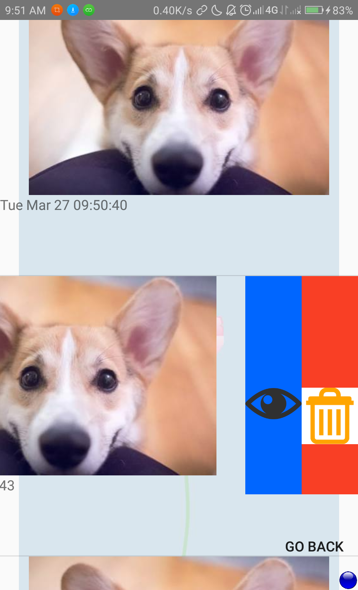

#         Duplicate Image Finder

**1.Tools and Technology used**

*         Android Studio
*         Core Java
*         Android SwipeLayout \[https://github.com/daimajia/AndroidSwipeLayout\]

**2.Assumptions**

*   The user will select an image for which he wants to find duplicates.
*   The user will select a directory in which he wants to search for duplicates.

**3.Working**

*   Choosing file, directories and deleting duplicates

### 4.Known issues

*   FileNotFoundException in some cases even if the file is present.
*   Quickpic image viewer not compatible.
